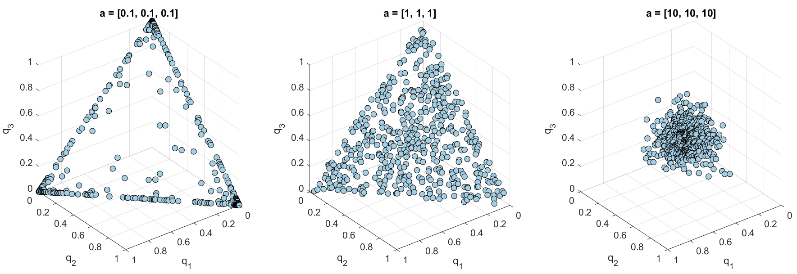

# dirichlet-matlab
MATLAB functions to generate random vectors from a Dirichlet distribution or to calculate the pdf from a Dirichlet distribution with given hyperparameters (A).

## Installation
You can add the dirichlet-matlab directory to your MATLAB search path:
```matlab
addpath(genpath('dirichlet-matlab'))  
```

## Example
```matlab
A = [2, 3, 4]; % Dirichlet hyperparameters (shape vector) for a 3-dimensional distribution

X = dirrnd(A, 5); % Generate 5 random vectors
X =
   0.165180831562802   0.572367339824971   0.262451828612227
   0.107682875327566   0.410558528169850   0.481758596502584
   0.124892099736948   0.230780581503848   0.644327318759204
   0.236682038827591   0.444503367825342   0.318814593347067
   0.407190742512644   0.164892120689403   0.427917136797953
   
Y = dirpdf(X, A); % Find probability densities for X
Y =
   3.286982736584238
   6.819059741097087
   5.978502390713254
   5.091775747161138
   2.914848702465950
   
[M,MO,V,CV] = dirstat(A) % Mean, mode, variance, and covariance for each dimension
M =
   0.222222222222222   0.333333333333333   0.444444444444444
MO =
   0.166666666666667   0.333333333333333   0.500000000000000
V =
   0.017283950617284   0.022222222222222   0.024691358024691
CV =

   0.017283950617284  -0.007407407407407  -0.009876543209877
  -0.007407407407407   0.022222222222222  -0.014814814814815
  -0.009876543209877  -0.014814814814815   0.024691358024691
```

## Random vectors from various (symmetric) Dirichlet distributions
```matlab
a = [10, 10, 10]; % Symmetric Dirichlet hyperparameters
x = dirrnd(a, 500); % Generate 500 random vectors
y = dirpdf(x, a); % Find probability densities for random vectors

% Plot
plot3(x(:,1), x(:,2), x(:,3), 'ko', 'MarkerFaceColor', [166, 206, 227]./255); 
box off; grid on;
xlim([0, 1]); ylim([0, 1]); zlim([0, 1]);
set(gca, 'XTick', 0:0.2:1, 'YTick', 0:0.2:1, 'ZTick', 0:0.2:1, ...
   'YDir', 'reverse', 'XDir', 'reverse');
title('a = [10, 10, 10]');
```
